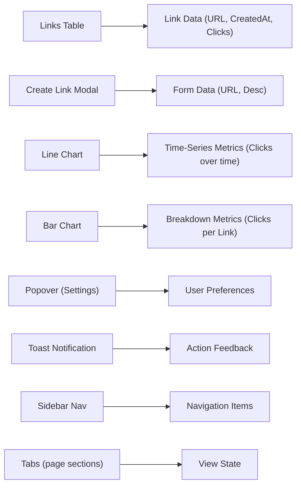
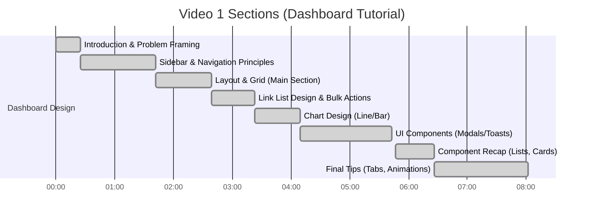
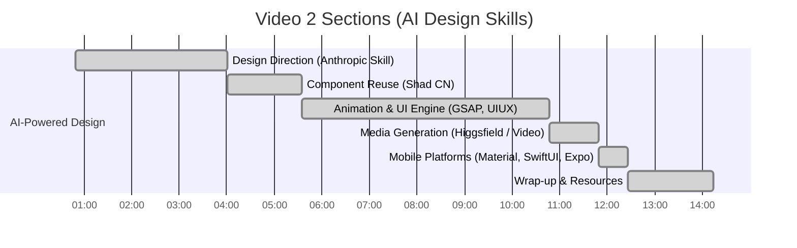

# Dashboard UI Design Insights (from Tutorial Videos)

**Executive Summary:** Two recent tutorial videos (Video 1: *Dashboard UI in 8 minutes* by Kole Jain, and Video 2: *“Insane Claude Design Skills”* by AI Labs) offer complementary insights into modern dashboard design. Video 1 is a step-by-step beginner-friendly guide to crafting a clean, usable dashboard interface. It emphasizes simplicity, a strong navigation **sidebar**, a strict grid layout, and clear data display. For example, the presenter notes that dashboards “suck” not for being ugly but for being *disorganized and messy*. Key takeaways include: **grouping** navigation links in a sidebar, using a two-column grid for *link lists and key metrics*, and keeping charts simple (basic line and bar charts with labels and selectors). The video also highlights practical UI components—lists/tables, cards, modals/popovers, and toasts—and discusses when to use each (e.g. popovers for simple context, modals for complex forms, toasts for notifications). Animations and interactions are minimal (hover effects on charts, optimistic UI for fast feedback). The speaker recommends Mobbin (a curated UI screenshot library) for inspiration.

Video 2, in contrast, surveys **AI-driven design “skills”** and tools that can make UIs feel more professional. Rather than a hands-on build, it reviews advanced design workflows for websites and apps. It stresses avoiding generic “AI slop” by enforcing a clear design direction through Anthropic’s *front-end design skill*. It then shows how to leverage real, pre-built UI components via **Shad CN** (a live component registry): instead of AI inventing components from scratch, it *pulls professional components from a library* for dashboards and apps. The video introduces animation best practices using **GSAP** (to keep transitions smooth and performance-friendly). It also covers design system approaches: applying **Material 3** (Google’s Android UI kit) for Android apps and **SwiftUI/Expo** for iOS/React Native apps. Image and video generation with **Higgsfield** (Seed Dance model) is shown for creating hero visuals. Overall, Video 2 presents a toolkit (Anthropic skill, Shad CN, GSAP, etc.) for injecting professional polish and consistency into AI-generated UIs.

Together, the videos suggest that a modern, aesthetic dashboard should combine the **clear structure and components** of Video 1 with the **advanced tooling and consistency** of Video 2. For example, designers should use a well-organized layout (sidebar navigation, grid cards, simple charts, modals and toasts as needed) while also adopting reusable components and design presets (e.g. Material/Apple UI rules, GSAP animations) to ensure a polished, product-grade feel. Both sources underscore that good dashboards **prioritize simplicity and user context** over complexity. The executive synthesis below will delve into each video in detail, with timestamps, direct insights, and practical takeaways for designers.

## Video 1: *“EVERYTHING you need to know to build a Dashboard UI in 8 minutes”* (Kole Jain, Apr 2026)

**Overview:** A concise tutorial on designing a clean, beginner-friendly dashboard. The host builds a link-tracking dashboard from scratch, focusing on clarity, navigation, and component usage. 

### Transcript Highlights (selected with timestamps)
- **00:00–00:25 Intro:** *“Dashboards are a staple… but most suck – not because they’re ugly, but because they’re disorganized and messy”*. The host promises to show how to create a *simple, aesthetic, usable* dashboard layout.
- **00:25–01:42 Sidebar (Spine of UI):** The **sidebar** houses navigation, profile, search (like “spine of your product”). It should use clear icons+labels (especially for collapsible mode), group links by relevance, and put rarely-used links (settings/help) at the bottom. An active-state indicator (e.g. a colored bar or background) highlights the current page.
- **01:42–02:21 Dashboards vs Landing Pages:** Dashboards pack more features into limited space. The speaker contrasts landing-page UI (large text, white space) with dashboards (smaller fonts, tighter spacing). He emphasizes strict grid alignment and that the **main section** must surface the user’s top priority data (project status, investments, etc.).
- **02:21–03:23 Layout Planning:** A *“simple two-column, two-row grid”* is chosen: top row for managing links, bottom row for key metrics/visualizations. The top bar will hold page actions (e.g. dropdown, “Create Link” button).
- **02:57–03:33 Link List:** The link management area is a table of links. Columns: favicon, short link, destination, created date, click count. The host suggests adding a description column if space allows. Each row could have a border, but stacking items in a simple list also works. Designing an *empty state* is noted as important for real apps. A micro-interaction: multi-select rows reveal bulk-action buttons for group operations.
- **03:39–04:09 Charts:** The bottom row will show data charts. Advice: avoid random charts (“don’t make weird shit”). Use familiar charts: e.g. a line graph (with gridlines, axis labels, date-range selector) and a bar chart (with icons, range selectors). Keep charts *“simple, informative, but also aesthetic”*.
- **04:09–04:28 Inspiration:** The host recommends **Mobbin** for UI inspiration, especially real dashboards and admin panels. (Mobbin provides curated screenshots from popular apps; using it sparked ideas for flows like user onboarding and settings.)
- **04:54–05:27 UI Interactions:** Up to now the page is static. To make it interactive: use **popovers** (non-blocking overlays, e.g. for simple settings, can click away); use **modals** for complex tasks (like “Create Link” form) that block the screen until submitted. After modal actions, show a **toast notification** to confirm success or errors (so users get feedback without leaving the page).
- **05:27–05:43 Navigation:** If a task requires leaving the page (e.g. viewing link details), navigate to a new page and include a back button or breadcrumb.
- **05:47–06:17 Component Recap:** The host summarizes that most dashboard pages use *four main component types*: lists/tables, cards (like charts/toasts), modals/popovers, and navigation elements (sidebar/tabs). He explains **lists/tables**: good lists use separation (space, dividers, or subtle background color). Good tables add interactive features (search, filters, sorting) to make the data usable.
- **06:18–06:34 Cards:** Dashboard “cards” (e.g. chart boxes, toast notifications) should have ample internal margin so content isn’t cramped, and use either subtle borders or background colors to distinguish them. (Tip: in light themes use light backgrounds; in dark modes often an outline suffices).
- **06:36–07:05 Forms & Tabs:** User input elements (forms, inputs) are common; e.g. the “Create Link” modal has a form, and settings pages use forms. **Tabs** are useful to show related views without new pages (e.g. Notion’s tabs for different table views).
- **07:08–07:30 Animations:** Dashboard animations are minimal but can enhance UX. For example, on hover the charts highlight values and dim others for focus. A final tip: use **optimistic UI** for responsiveness (e.g. remove an email immediately on delete, as Gmail does) so the app feels snappy.

> *“Just do one thing well with your dashboard. […] When compared to some websites, dashboard animation is pretty tame and user-focused.”*

### Concise Section Summary

- **Intro (0:00–0:25):** Dashboards fail due to clutter, not lack of style. The goal is a simple, elegant layout that “feels effortless” to use.
- **Sidebar (0:25–1:42):** Left navigation is crucial. Use recognizable icons + labels, group links logically, and include profile/search. Keep frequently-used links up top, rare actions (settings/help) at bottom. Provide a clear active-state indicator.
- **Layout (1:42–2:39):** Dashboards require smaller text and strict grids. The main content area must reflect user priorities (e.g. project status). The video uses a 2×2 grid: top row for lists (links), bottom row for metrics/charts.
- **Link List (2:39–3:33):** The top-left area is a table of short links (columns for icon, URL, date, clicks) with enough spacing. Optional features: row selection for bulk actions (reveals contextual buttons), empty-state design, and a description field.
- **Charts (3:33–4:09):** Two simple charts: a line chart (with time selector) and a bar chart (with favicon legend, range selector). Emphasize grid lines, labels, and clarity over decoration.
- **Inspiration (4:09–4:28):** Use **Mobbin** as a UI inspiration library to see how real apps layout dashboards, flows, and charts.
- **UI Elements (4:54–5:43):** Incorporate **popovers** for in-page edits (e.g. toggling display settings) and **modals** for tasks (e.g. creating a new link). Always provide feedback via **toast** notifications for success/errors.
- **Navigation & Components (5:43–6:26):** Use back buttons or breadcrumbs on sub-pages. Key dashboard components: *Lists/Tables* (separated by space, lines, or color; with search/filter/sort); *Cards/Charts/Toasts* (keep margins wide and use light borders or backgrounds); *Forms* (for data entry in modals); *Tabs* (for related views without cluttering sidebar).
- **Animations & Final Tips (6:26–8:02):** Add hover effects on charts (tooltips, dim others). Use **optimistic updates** for a fast UX (e.g. remove items immediately on delete). The result is a **functional, aesthetic dashboard** that’s easy to build and use.

### Skills/Tools Mentioned (Video 1)
- **Mobbin** – a curated UI design gallery. Used for real-world dashboard inspiration (screenshots of admin apps, charts, flows). Designers can copy designs into Figma or filter by component/industry on Mobbin.
- **UI Components (Tabs, Modals, Popovers, Toasts)** – standard UI patterns. Video explains when to use each (popovers for simple context, modals for multi-field forms, toasts for notifications). They are implemented via HTML/CSS or frameworks (e.g. Bootstrap, Material) in real projects.
- **Charts (Line, Bar)** – basic data-visualization components. The tutorial shows how to include grid lines, labels, and selectors for clarity. In practice, libraries like Chart.js or D3.js can create these.
- **Optimistic UI** – a UX pattern where the interface updates immediately (assuming success) before server confirmation. For example, Gmail deletes an email instantly. This reduces perceived latency and is an advanced JavaScript technique (e.g. using React Query or local caching).
- **CSS Grid/Flexbox** – not named explicitly, but the layout relies on CSS grid/flex for the 2×2 arrangement. 
- **Design Resources** – The video itself is a tutorial, but it mentions companies (Dub, Linear) and tools (Notion, Vercel) as examples of good UI patterns.

### Design Principles & Notes (Video 1)
- **Simplicity over Clutter:** Focus on one main function per page. The host warns against an “empty drawer” dashboard. Reduce cognitive load by grouping related links and using clear icons. 
- **Typography:** Use smaller font sizes and less line-height than a marketing page. For dashboards, more text fits on screen, so scale down headers and keep few font sizes.  
- **Grid & Layout:** Strictly follow a grid (as much of the screen is used). The example uses a two-column grid, but even a single column needs consistent row alignment. Margins should be generous to prevent crowding (spacing is a key “separation” technique).
- **Colors & Spacing:** Generally use neutral backgrounds; highlight elements (active states, notifications) with accent colors. The video notes lists/tables can use subtle backgrounds or outline lines for separation. Cards can either have a light fill or just a border: outline on dark theme, fill on light theme.
- **Consistency & Feedback:** Active states (highlight in sidebar) and hover effects on charts provide feedback. Empty states and toasts ensure the user is never left wondering what to do or if an action succeeded.
- **Animations:** Very modest on dashboards. Use simple hover reveals on charts. Avoid flashy transitions; aim for smooth and fast (no janky reflows). The concept of *optimistic updates* keeps the interface responsive.
- **Resources & Inspiration:** Consult curated design systems or libraries (e.g. [Mobbin][45]) to see how professional apps handle dashboards and forms. Emulate spacing, labeling, and chart styles from successful products.

### Key Components and Data (Video 1)
From the tutorial, we identify four main component types and associated data:

- **Lists/Tables (Link List):** Display link records (columns: icon, short URL, full URL, creation date, click count). Data comes from the link database. Supports multi-select, filters, and sorting.
- **Cards/Charts:** Visualize metrics. One card contains a **line chart** for clicks/signups over time (with axes labels and date range selector); another card has a **bar chart** breaking down clicks by link (with icons and toggle options). Data: time-series stats and per-link counts.
- **Modals/Forms:** For actions like *“Create Link”*. Data fields: URL input, description, etc. Submitting the form sends new link data to the server. 
- **Popovers/Tooltips:** Contextual overlays (e.g. display settings). Data: UI preferences (toggles). Non-blocking, ephemeral.
- **Toasts/Notifications:** Show operation results. Data: confirmation messages (success/error). Triggered by actions in modals or other tasks.
- **Navigation (Sidebar):** Lists app sections and holds global controls (profile, search). Data: static menu items and possibly dynamic notification badges.

### Suggested Dashboard Layout (Video 1)

Based on the video’s example, a recommended dashboard wireframe is:

- **Left Sidebar (Fixed):** Logo at top, profile avatar/menu near top, main navigation links (e.g. *Dashboard, Reports, Settings*) grouped together, settings/help links at bottom. Collapse support with tooltips or labels. (This matches the “spine” described.)
- **Top Bar:** Site title or page title, plus global actions (search bar, create/add button). In the demo, a dropdown (site selector) and “Create Link” button occupy the top right.
- **Main Grid (Content):** A 2×2 grid under the top bar:
  - *Top-Left:* **Link Table** – a scrollable list with columns for link info and click count. Includes a bulk-action toolbar when rows are selected.
  - *Top-Right:* **Key Action Panel** – (e.g.) callout cards or quick stats. In the demo a placeholder or summary (could include a small widget like “Active Links”).
  - *Bottom-Left:* **Line Chart Card** – displays trends (e.g. daily clicks). Has date-range filter.
  - *Bottom-Right:* **Bar Chart Card** – breakdown by link (with favicon icons). Includes conversions/signups and its own range selector.
- **Modals/Popovers:** “Create Link” opens a modal with a form. Settings toggle might open a popover in place (no page navigation).
- **Toasts:** Notification popups appear on top after actions (e.g. “Link created!”) without blocking the UI.
- **Tabs/Sub-Pages:** If needed, a tab bar under the main content can switch views (like Notion does for related tables).

This layout reflects the video’s structure (two-column grid, clear groupings) and ensures a balance of navigational elements (sidebar/tabs) and data display (table + charts).

### Links to Official Docs / Resources (Video 1)
- **Mobbin (UI Inspiration):** [mobbin.com][45] – curated gallery of UI screenshots (desktop & mobile apps).  
- **Chart Libraries:** (e.g.) [Chart.js][61] or [D3.js][62] – popular JS libraries for line/bar charts.  
- **UI Component Libraries:** (e.g.) [Bootstrap](https://getbootstrap.com/docs/5.0/components/modal/) or [Material UI](https://mui.com/components/) – for modals, popovers, toasts.  
- **CSS Layout:** MDN docs on [CSS Grid](https://developer.mozilla.org/docs/Web/CSS/CSS_Grid_Layout) and [Flexbox](https://developer.mozilla.org/docs/Web/CSS/CSS_Flexible_Box_Layout) – for implementing the grid.  
- **Optimistic UI Pattern:** Articles like [this React Query example][63] explain optimistic updates for snappy UX.

## Video 2: *“Insane Claude Design Skills You Need To Build Beautiful Websites”* (AI Labs, Jun 2026)

**Overview:** A deep-dive into AI-driven UI design skills that enforce consistency and reusability. Unlike Video 1, this video is not a single dashboard demo but an expert walkthrough of tools (mostly for *Claude* AI agents) that produce polished UIs. The host (Ian from AI Labs) emphasizes that _pretty_ AI designs can all look the same, so the solution is to use structured **“skills”** (prompting modules) to dictate style, components, and motion. The video is chaptered into sections covering design direction, component reuse, animations, and mobile UI systems. 

### Transcript Highlights (selected with timestamps)
- **00:00–04:01 (Design Direction):** The video starts by identifying the problem: AI designs tend to default to the most common patterns, causing sameness. As a remedy, the **Anthropic front-end design skill** is used. It *“forces the model to commit to a real design direction before it writes anything”*, preventing it from choosing overused defaults (e.g. purple gradients). The skill’s rules (“skill.md”) explicitly call out common AI mistakes so the model avoids them. Ian explains they use this skill primarily for landing pages and portfolios where style matters.
- **04:01–05:35 (Shad CN – Component Reuse):** Transition to **Shad CN (Shadsen + MCP)**: an open-source framework for real UI components. Instead of AI coding each widget, the agent can *pull pre-built React components* (buttons, charts, forms) from the Shad CN registry. Shadsen is the “rulebook skill” ensuring outputs follow Shad CN conventions, and MCP is the live component “shop” that the AI browses. This yields UI code that feels like a shipped product because it starts from professional-grade parts (e.g. Vercel’s forms, charts) rather than a scratch draft.
- **05:35–10:47 (Animation & UI/UX Engine):** Introduces the **GSAP skill**: since AI often only knows slide-in-on-scroll animation, GSAP (GreenSock) provides expert guidelines for rich, efficient animations. The skill tells the model to use browser-friendly transforms (avoiding layout thrashing), so animations remain smooth. Next, **UIUX Pro Max** is shown: it runs an actual engine (five parallel style searches on GitHub) to tailor the design system to the product’s domain. This engine selects a color palette, font pair, and layout that fit the industry, then feeds those rules to the model, ensuring the final site has a strong, custom look.
- **10:47–11:49 (Media Integration):** Covers **Higgsfield** for images/video: it hooks various text-to-image and text-to-video models into the workflow. The agent can request, say, a hero image or looping background clip directly, and Higsfield (or Seed Dance for video) generates it, saving the step of manual design.
- **11:49–12:26 (Mobile Platforms):** Emphasizes that mobile design is unique. A **Mobile App UI Design** skill encodes principles like thumb-zone placement and consistent spacing (inspired by Airbnb/Duolingo/Spotify guidelines). Then **Material 3** (Google’s UI kit) gives the model the full Android design language (bold color schemes, rounded shapes) and checks guideline compliance. For iOS, a **SwiftUI** skill feeds Apple’s official Human Interface Guidelines from Xcode documentation, so the app looks “native” with the translucent “liquid glass” style. If targeting both, **Expo** is used as a cross-platform skill.
- **12:26–13:42 (Conclusion & Sponsor):** Recaps that all these skills (design direction, Shad CN, GSAP, Material/SwiftUI, etc.) are available in **AIABS Pro** (the channel’s toolkit). The host notes this workflow turns AI output from “rough drafts” into finished products. (A brief sponsor message for a research tool is inserted at 13:42.)

> *“If you want to ship real product-grade websites… pair design intent with validated component libraries and animation practices.”*

### Concise Section Summary

- **Design Direction (Anthropic Skill, 00:49–04:01):** Use a front-end design prompt that *forces the AI to pick a coherent style* from the start. Ian explains that without it, the model will default to generic, safe designs (e.g. same fonts/gradients). This skill (often called *“break the default”*) embeds rules so the AI commits to a distinctive aesthetic (e.g. “no purple gradients”), yielding unique landing pages.
- **Component Reuse (Shad CN, 04:01–05:35):** Instead of coding components manually, instruct the model to **pull from Shad CN’s component registry**. Shadsen (the skill) ensures the result follows Shad CN’s UI rules, and Shad CN MCP connects to its live component library. As a result, dashboards and apps use real, pre-made parts (professional tables, charts, cards) rather than AI-imagined ones.
- **Animation & UX Engine (05:35–10:47):** Encourage the model to use **GSAP** for web animations: the skill tells it to apply performance-friendly transforms and offers a full range of motion capabilities. Then the **UIUX Pro Max** skill runs a style-selection engine (searching a database of industry templates) to determine the appropriate palette, fonts, and layout for the site’s niche. This closes the “one-size-fits-all” gap by giving each project a custom design system.
- **Media Content (10:47–11:49):** Integrate **Higgsfield** (and Seed Dance for video) so the AI can generate hero images or backgrounds in-context. This provides on-brand visuals (or animated clips) without leaving the coding environment.
- **Mobile Guidelines (11:49–12:26):** Apply mobile-specific skills: a general *Mobile UI* skill encodes thumb-zone and spacing rules. The **Material 3** skill supplies Google’s design library for Android (bright colors, shapes). The **SwiftUI** skill provides Apple’s Human Interface Guidelines from Xcode, ensuring iOS apps have the native look (light, translucent aesthetic). If targeting both, the **Expo** skill enables one codebase for Android+iOS.
- **Wrap-up (12:26–14:14):** All these AI “skills” and starter packs are available via AIABS Pro community. By combining them, teams can get end-to-end workflows for designing websites and apps that feel like real products (anthropic skill for direction + Shad CN for components + GSAP for motion + platform-specific guidelines).

### Skills/Tools/Technologies Mentioned (Video 2)
- **Anthropic Front-End Design Skill:** A prompt-based “skill” that sets an overall style. It forces the AI model to choose a strong design direction and warns against generic choices. (In practice, this is an open-source skill from Anthropic’s repo; it’s used at the start of the prompt.) 
- **Shad CN (Shadsen & MCP):** Open-source design system and component registry. *Shadsen* is a skill (rulebook) that ensures AI output conforms to Shad CN’s UI patterns. *Shad CN MCP* is a runtime registry: the agent can search and import real React components (buttons, charts, modals, etc.) from the Shad CN library. This replaces fabricated code with polished components.
- **GSAP (GreenSock Animation Platform):** A high-performance JS animation library. The video’s GSAP skill guides the model to use GSAP-friendly transformations (no layout thrashing) for smooth animations. Official docs: [GSAP Docs][47].
- **UIUX Pro Max (Design Engine):** A custom skill that runs a style-engine. It queries a database of design templates (161 categories) and picks a color palette, typography, and layout matching the project, then feeds that to the model. (This is part of AI Labs’ toolkit.)
- **Higgsfield:** An AI image/video generation platform. Its CLI/app provides an interface for the coding agent to generate on-demand visuals. For videos, it uses **Seed Dance** (video model) or others. Helps create hero images or clips directly from prompts.
- **Material 3:** Google’s latest Android design system. The Material 3 skill gives the model Google’s official components/colors (bold, rounded shapes) and checks guidelines compliance. Official docs: [Material 3 guidelines][52].
- **SwiftUI:** Apple’s declarative UI framework for iOS. The SwiftUI skill extracts Apple’s HIG documentation into the prompt so the model follows Apple’s “liquid glass” design (subdued translucency). Official docs: [Apple SwiftUI][55].
- **Expo:** A cross-platform mobile framework. The Expo skill ensures navigation and styling work for both Android and iOS from one codebase (using React Native under the hood). Official docs: [Expo Docs][58].
- **Mobile UI Design (General):** A skill encoding general mobile UX rules (thumb reach, font scaling, spacing) taken from top apps (Airbnb, Duolingo, Spotify).
- **UI Style Presets:** Skills like *Minimalist UI*, *Brutalist UI*, *Premium UI*, and *Front-End UIUX* are one-shot modifiers. They push the model toward a specific aesthetic (e.g. sparse vs. raw vs. high-end fashion look). These are not tools per se, but preset prompts.
- **AIABS Pro:** The ecosystem/community where these skills and templates are distributed (subscription-based).

### Design Principles & Notes (Video 2)
- **Consistent Design Direction:** Emphasize a single aesthetic thread. The Anthropic skill and UIUX Pro Max ensure the design doesn’t drift into the AI’s defaults. This means dashboards (and landing pages) will have intentional color schemes and font choices, rather than looking boilerplate.
- **Component Reuse:** Leverage existing UI libraries. The Shad CN workflow shows that using real-world components leads to interfaces that “feel like a real product”. For dashboards, this could mean using professional-grade tables, form controls, and charts instead of homemade ones.
- **Performance Animations:** Use animation libraries like GSAP and follow its guidance for transitions. That means avoiding heavy transforms; for example, animate via `transform: translate/scale` instead of layout changes.
- **Mobile/Platform Guidelines:** Follow Google’s Material Design ethos (bold colors, large tappable shapes) for Android dashboards, and Apple’s Human Interface style (subtle translucency, clarity) for iOS. Arrange navigation differently on mobile (bottom bars, swipe gestures) as hinted by the mobile skills.
- **Imagery:** Use AI-generated visuals to enhance dashboards (e.g. a subtle animated background). The video suggests plugging in relevant images or loops without leaving the coding flow.
- **Design System Thinking:** The overall approach is to treat design rules and components as modular, reusable assets. The dashboards should be built from these “starter packs” to maintain quality.

### Suggested Components and Layout (Video 2)

While Video 2 is about workflows rather than a specific layout, we can translate its suggestions to dashboard design:

- **Design Direction Skill:** Start by defining the dashboard’s theme (e.g. “Corporate Modern” or “Tech Analytics”). Use Anthropic’s skill or a similar prompt to generate color/font guidelines. This ensures consistency between sidebar, cards, charts, and forms.
- **Prebuilt Components (Shad CN):** Replace custom code with industry-standard components. For example, use a professional **Table** component (with built-in search/filter) for the link list, a polished **DatePicker** for selectors, and ready-made **Card** and **Chart** components from a library. This aligns with “pulling from a registry”.
- **Animations (GSAP):** Animate chart reveals and menu transitions with GSAP-configured effects. For example, when the charts load or when tabs change, use GSAP tweens (fade-ins, slide-ups) as prescribed. 
- **Mobile Layout (Material/Swift):** When designing the mobile version of the dashboard, use the Material 3 color palette and component set if on Android, or Apple’s components for iOS. Ensure key buttons are within thumb reach (e.g. one-hand-friendly placement).
- **Image/Video Content:** If the dashboard has a hero graphic or tutorial video, generate it via Higgsfield/SeedDance so that it matches the dashboard style (e.g. background animation that reflects the company’s brand colors).
- **Wireframing:** Combine both videos by sketching a wireframe that uses Video 1’s structure but with Video 2’s polish. For instance, draw the sidebar and 2×2 grid layout, then annotate that each component (cards, table, modals) should be drawn from a design system (Material or Shad CN). Label interactive flows (popovers, modals, toasts) and note that CSS should be optimized (following GSAP advice).

### Links to Official Docs / Resources (Video 2)
- **GSAP:** [GreenSock Docs][47] – official guides for web animation.  
- **Shad CN:** [ShadCN UI Components][64] – open-source React components library. (See their GitHub/registry for ready-made UI kits.)  
- **Higgsfield:** [higgsfield.ai][60] – platform homepage describing AI image/video generation capabilities.  
- **Material Design 3:** [Android Material 3 Guide][52] – official Google documentation on the Material 3 design system.  
- **SwiftUI:** [Apple Developer – SwiftUI][55] – official Apple documentation for SwiftUI (iOS UI framework).  
- **Expo:** [Expo Docs][58] – guides for building cross-platform apps with React Native.  
- **AIABS Pro:** (Proprietary resource) the video’s sponsor site for these AI design skills and templates.  

## Cross-Video Skills Comparison

| **Skill/Tool**                  | **Video(s)**      | **Purpose / Use in Video Context**                                            | **Proficiency Level**       |
|---------------------------------|-------------------|-------------------------------------------------------------------------------|-----------------------------|
| **Mobbin** (UI Inspiration)     | 1                 | UI gallery for design ideas (curated screenshots of real dashboards/apps). Helps pick good layouts and flows. | Beginner – Novice use       |
| **Sidebar Navigation** (UI pattern) | 1             | UI pattern for global nav; groups links logically to reduce cognitive load.  | Beginner – Fundamental      |
| **Data Visualization (Line/Bar)** | 1               | Chart components to display metrics; uses simple axes, grids, labels for clarity.  | Intermediate                 |
| **UI Components (Tabs, Modals, Toasts)** | 1        | Standard UI patterns: modals for forms, popovers for quick actions, toasts for feedback. | Beginner – Fundamental      |
| **Optimistic UI** (pattern)     | 1                 | UX technique (update UI immediately on actions) exemplified by Gmail delete. Improves perceived performance. | Intermediate                 |
| **Anthropic Front-End Skill**   | 2                 | AI design skill enforcing a committed style direction to avoid generic outputs. | Advanced (AI engineering)   |
| **Shad CN (Shadsen + MCP)**     | 2                 | AI design skill + registry: lets model pull real pre-built UI components instead of inventing them. | Advanced (AI/web)           |
| **GSAP (Animation Library)**    | 2                 | JavaScript library for performant animations. Skill steers AI to use GSAP patterns for smooth motion. | Intermediate – Advanced     |
| **Higgsfield (AI Media Gen)**   | 2                 | AI image/video generation service. Enables generating on-brand visuals (images, clips) in design workflow. | Advanced (emerging tech)    |
| **Material 3 (Google Design)**  | 2                 | Mobile design system. Provides color scheme, components for Android UI (bold, colorful style). | Intermediate                |
| **SwiftUI (Apple Design)**      | 2                 | iOS UI framework. Skill uses official HIG to produce Apple-style interfaces (liquid, translucent). | Intermediate                |
| **Expo (Cross-Platform)**       | 2                 | Framework for building one app for Android+iOS. Ensures shared navigation/styling in both platforms (mentioned in context). | Intermediate                |
| **Mobile App UI Guidelines**    | 2                 | Encoded mobile design rules (thumb zone, spacing) as a skill. Ensures mobile dashboards respect ergonomics. | Intermediate                |
| **UI Style Presets (Minimalist, Brutalist, UIUX, Premium)** | 2 | One-shot prompt modifiers for specific aesthetics (e.g. clean vs. bold vs. luxury). Used to steer final look. | Intermediate                |

*(Notes: “Video(s)” indicates where the skill/tool is discussed. Level is implied by context: Video 1 is a beginner tutorial, Video 2 targets advanced AI-assisted design.)*

## Beyond This Dashboard

Layout and information-architecture patterns the two videos don't cover — the material that separates a tidy dashboard from a *useful* one.

### How the iSN dashboard applies (or diverges from) the video advice
- Sidebar navigation (`sidebar.tsx`, grouped items, collapse state persisted in localStorage) matches Video 1's "spine" advice; the header is a glass/pill-nav variant
- Cards are the layout unit (`.card-ventriloc`), charts are simple Recharts line/bar wrappers, and tables have server-side search/filter/sort with debounced input — Video 1's checklist, but with the filtering pushed to the backend
- shadcn/ui is the component registry in production here, exactly the Video 2 "pull real components" workflow
- Divergence: no optimistic UI (mutations are rare and admin-only), animations are CSS/Framer-Motion rather than GSAP, and the background effects (aurora CSS, canvas particles) are ambient rather than content-adjacent

### Information hierarchy patterns
- **KPI pyramid:** one page answers one question. Top row = 3–5 outcome KPIs (the "so what"), middle = diagnostic charts (the "why"), bottom = record-level tables (the "which ones"). Users should be able to stop reading at any row and still have an answer.
- **Progressive disclosure / drill-down contract:** every aggregate should be clickable down to its constituent rows (KPI → filtered chart → filtered table → record detail). Dead-end numbers erode trust.
- **Overview → zoom-and-filter → details-on-demand** (Shneiderman's mantra) is the interaction spec for any analytics view; if a design can't name which of the three a widget serves, cut the widget.
- **F/Z-pattern placement:** the top-left cell gets the single most important metric; bottom-right gets the least. Users scan dashboards, they don't read them.

### States the tutorials skip (and real dashboards live in)
Every widget needs a designed **quintet**: loading (skeleton mirroring final layout), empty (first-run guidance with a CTA), partial (some series failed — label it), error (retry affordance, never a blank card), and stale (a data-age indicator — "as of 14:02" — critical for periodically-ingested data like this platform's 6-hour refresh cycle).

### Filters and time as first-class layout citizens
- **Global filter bar vs per-widget filters:** decide explicitly. Global filters (date range, tenant/project) belong in a persistent bar under the header; widget-local filters must be visually distinguishable or users mistrust every number.
- **URL as filter state:** serializing filters into the query string (as this dashboard does for the visits table) gives shareable, bookmarkable, back-button-friendly views for free — the single highest-value dashboard feature tutorials never mention.
- **Comparison affordances:** every time-series metric wants a "vs previous period" delta with direction and color; every target-bearing KPI wants a progress treatment, not a bare number.

### Density and personalization
- **Density modes** (comfortable/compact) matter more on dashboards than on any other app type — analysts want compact, executives want comfortable. Implement as a spacing-token multiplier.
- **Saved views** beat drag-and-drop widget rearrangement in cost/benefit: persisting named filter+column+sort combinations covers most personalization demand without a grid-layout engine (react-grid-layout et al. is a last resort — it fights responsive design).
- **Responsive strategy:** dashboards don't reflow well below tablet width; prioritize (KPIs → primary chart → table) and *drop* tertiary widgets on mobile rather than stacking everything into an endless scroll.

